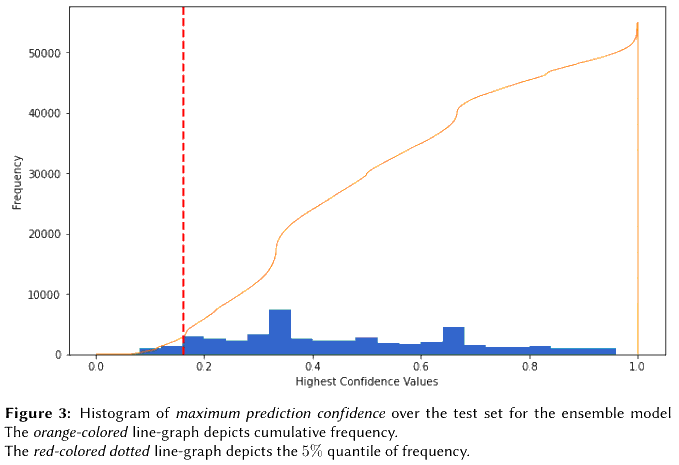

# FungiCLEF-22

Scripts, figures and working notes for the participation in [FungiCLEF 2022](https://www.imageclef.org/FungiCLEF2022), part of the [LifeCLEF labs](https://www.imageclef.org/LifeCLEF2022) at the [13th CLEF Conference, 2022](https://clef2022.clef-initiative.eu/index.php).

## Quick Links

The following references will help in reproducing this implementation and to extend the experiments for further analyses.

- [Manuscript [PDF]](https://ceur-ws.org/Vol-3180/paper-162.pdf)
- [Model Training Scripts](./Scripts/train)
- [Concept and Dataset Description](https://www.imageclef.org/FungiCLEF2022)

## Cite Us

[Link to the Research Paper (preprint)](https://ceur-ws.org/Vol-3180/paper-162.pdf)

If you find our work useful in your research, don't forget to cite us:

```
@article{desingu2022classification,
  url = {https://ceur-ws.org/Vol-3180/paper-162.pdf},
  title={Classification of fungi species: A deep learning based image feature extraction and gradient boosting ensemble approach},
  author={Desingu, Karthik and Bhaskar, Anirudh and Palaniappan, Mirunalini and Chodisetty, Eeswara Anvesh and Bharathi, Haricharan},
  keywords={Ensemble Learning, Convolutional Neural Networks, Gradient Boosting Ensemble, Metadata-aided Classification, Image Classification, Transfer Learning},
  journal={Conference and Labs of the Evaluation Forum},
  publisher={Conference and Labs of the Evaluation Forum},
  year={2022},
  ISSN={1613-0073},  
  copyright = {Creative Commons Attribution 4.0 International}
}
```

## Key Highlights

### Proposed Prediction Workflow

- Each *observation* in the dataset is made up of numerous fungus photos and its contextual geographic information like nation, exact area where the photograph was taken on four layers, along with specific attributes like substrate and habitat. 
- Each image in an observation is preprocessed before being fed through the two feature extraction networks to generate two 4096-element-long representation vectors. - These vectors are combined with numeric encoded nation, location at three-level precision, substrate, and habitat metadata for the image to produce a final vector with a size of 8198. 
- The boosting ensemble classifier is fed all the 8198 features to generate a probability distribution over all potential fungi species classes. 

This workflow is depicted below,   


### Managing Out-of-Scope Classes

- Some fungi classes in the dataset were exclusive to the test set, and were not exposed to the architicture during model training. These classes are herein referred to as *out-of-scope* classes.
- A *prediction confidence thresholding* method was devised to handle out-of-the-scope classes. 
- A threshold value is arrived at for each trained ensemble model by adopting a qualitative, trial-based method. 
- First, a histogram of maximum prediction probabilities of the model for each observation in the test set is plotted. 

The histogram for the best performing model instance is depeicted below,     


- The x-axis represents the maximum confidence values for predictions on the observations,
while the y-axis tracks the frequency of these maximum confidence values. 
- Subsequently, the x-axis point of 5% cumulative frequency is identified (denoted by the red-colored dotted-line above). 
- Multiple points — typically, 2-4 points during experiments — on the left-hand side of this 5% quantile line are chosen as threshold values, and predictions are made based on each of these threshold values.

### Conclusions and Future Scope

- The ensembling approach was found to be an effective option for applying to data-intensive and high-complexity image classification tasks that are commonly released at LifeCLEF. 
- The inclusion of contextual information showed a strong impact on the classification results — the F1-scores for the best models improved from 61.72% and 41.95% to 63.88% and 42.74%.
- We further conjecture that training the individual models to convergence, and subsequently applying the boosting ensembler with
hyperparameter tuning will culminate in a superior prediction performance, that exhausts the proposed architectures’ and methodology’s potential. 
- In addition, approaches involving input image resolution variations, usage of alternative pre-trained weights [[A. Joly et al.](https://link.springer.com/chapter/10.1007/978-3-030-58219-7_23)], as well as the inclusion of custom training layers to the frozen base model when transfer learning [[M. Zhong et al.](https://www.sciencedirect.com/science/article/abs/pii/S0003682X20304795)] can greatly improve the quality of feature extraction. 
